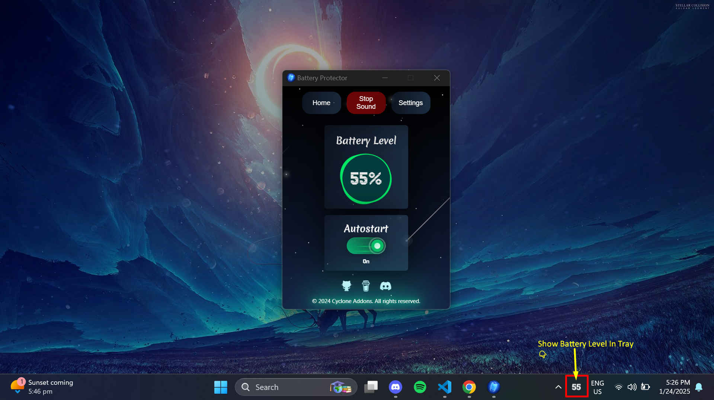

# 🛡️ Battery Protector
<p align="center">
  
</p>

Battery Protector is a lightweight software for Windows that alerts the user when the battery reaches 80% and plays music until the charger is unplugged. It also displays the battery percentage in the system tray.

---

## 🚀 Features

- 🔔 **Battery Alert**: Notifies the user when the battery reaches 80%.(Soon Customizable)
- 🎵 **Music Alert**: Plays music until the charger is unplugged.
- 📌 **Tray Icon**: Displays the current battery percentage in the system tray.
- ℹ️ **Battery Status Tooltip**: Shows detailed battery status in the tray icon tooltip.(Soon)
- ⚙️ **Customizable Alerts**: Will allows users to customize alert sounds and notification settings.(Soon)

---

## 📥 Installation

1. Clone the repository:
   ```sh
   git clone https://github.com/CycloneAddons/battery-protector.git
   ```
2. Navigate to the project directory:
   ```sh
   cd battery-protector
   ```
3. Install dependencies:
   ```sh
   npm install
   ```
4. Run the project:
   ```sh
   npm run tauri dev
   ```
   ### <p align="center">OR</p>

    ```sh
   npm run tauri build
    ```

---

## 🪄 Download Links

<p align="center">
<a href="https://github.com/CycloneAddons/battery-protector/releases/download/v0.1.0/Battery.Protector_0.1.0_x64_en-US.msi" target="_blank">
    
  </a>   
  <a href="https://github.com/CycloneAddons/battery-protector/releases/download/v0.1.0/Battery.Protector_0.1.0_x64-setup.exe" target="_blank">
    
  </a>
  
</p>


---

## 📖 Usage

The application will start monitoring the battery status once launched:

- ⚡ When the battery reaches **80%**, an alert sound will play, and the battery percentage will be displayed in the tray icon.
- 🔌 The alert sound will continue until the charger is unplugged.

### <p align="center">📷 Screenshot Demonstration</p>  
<p align="center">
  
</p>

### <p align="center">📷 Video Demonstration</p>  
<p align="center">Soon
  <!-- <a>
    
  </a> -->
</p>

---

## 🤝 Contributing

We welcome contributions to make **Battery Protector** better! To contribute:

1. Fork the repository.
2. Create a new branch:  
   ```sh
   git checkout -b feature-name
   ```
3. Commit your changes:  
   ```sh
   git commit -m "Add your message here"
   ```
4. Push the branch:  
   ```sh
   git push origin feature-name
   ```
5. Submit a pull request.

---

## 📜 License

This project is licensed under the **MIT License**. See the [LICENSE](./LICENSE) file for details.

---

## 🛠 Maintenance

This project is actively maintained. For bug reports or feature requests, please [open an issue](https://github.com/CycloneAddons/battery-protector/issues).

---

> **Note**: Currently, this project is intended for **Windows users only**.

---
### 👨‍💻 Developer & Owner

**Developed and owned by Cyclone Addons**  
[GitHub Profile](https://github.com/CycloneAddons)

---

### ❤️ Support

If you find this project helpful, consider giving it a ⭐ on GitHub!

<a href="https://www.buymeacoffee.com/cycloneaddons">
  
</a>

  
